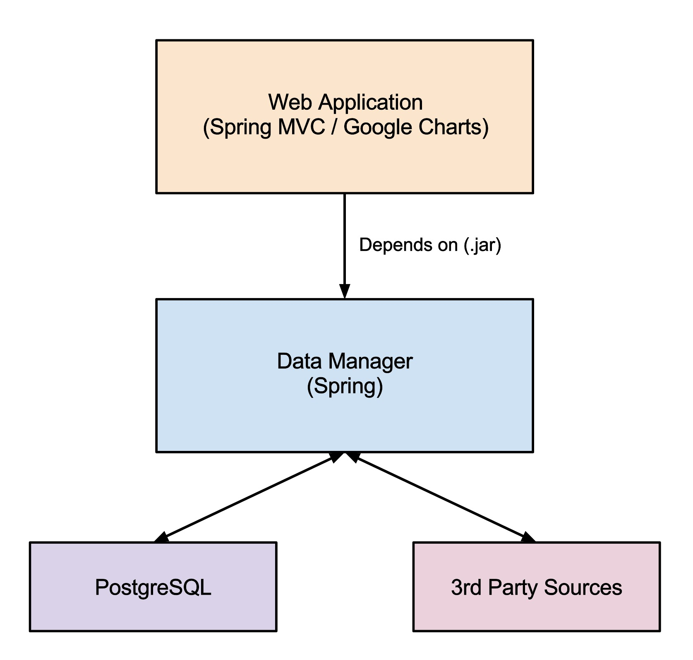
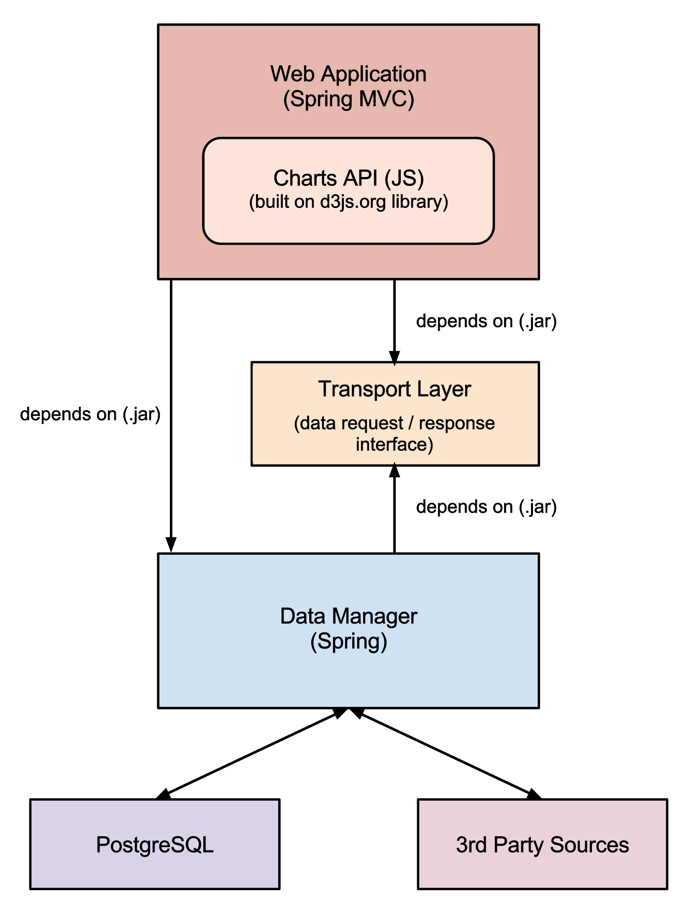
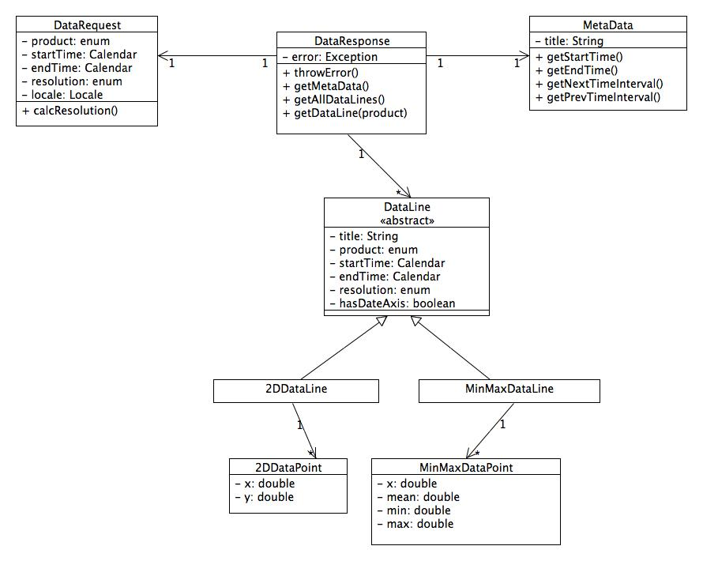

# Enwida IDP Project

## Teams

### User Management, Data Download / Upload
- Olcay
- Abdul

### Charts, Communication with Data Manager
- Atif (Spring)
- Jitin (Charts / JS)
- Daniel (Charts / JS)

## Existing Architecture

### Problems
- Tight coupling of web application and data manager
- Google Charts license doesn't allow self-hosting
- Google Charts API doesn't provide special chart types (carpet chart, min-max chart)
- Missing download / upload function

## New Architecture

### Tasks
- Defining the transport layer interfaces / classes
- Rewrite the web application from scratch
    - User Management
    - Download / Upload
    - Communication with Data Manager using new interface
- Write Charts API
    - Chart Types
        - Line Chart
        - Bar Chart
        - Carpet Chart
        - Min-max Chart
    - Axis Types
        - Number
        - Date
    - Navigation
        - Show / hide lines
        - Product selection
        - Time range selection

## Transport Layer

### UML Draft

