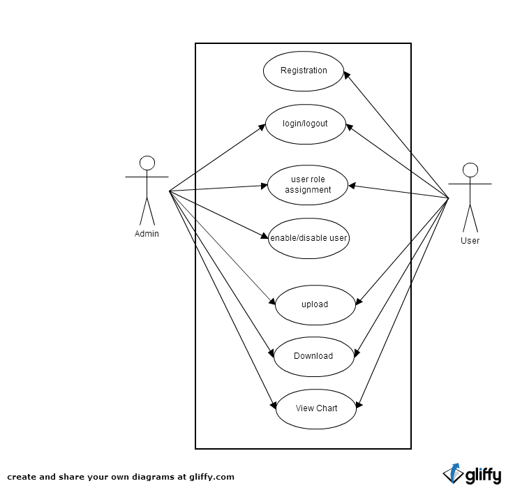

#User Management
Users can register themselves to the webpage and data is stored into database. Next time, users are indentified using browser cookies.

###DataBase Fields

####User table
-	Username 
-	Name-LastName
-	Password
-	Roles

####Custom Charts
-	Chartdata
-	Charttype

####Roles
-	Roles

####User Rights
-	Time
-	Product
-	Resolution

