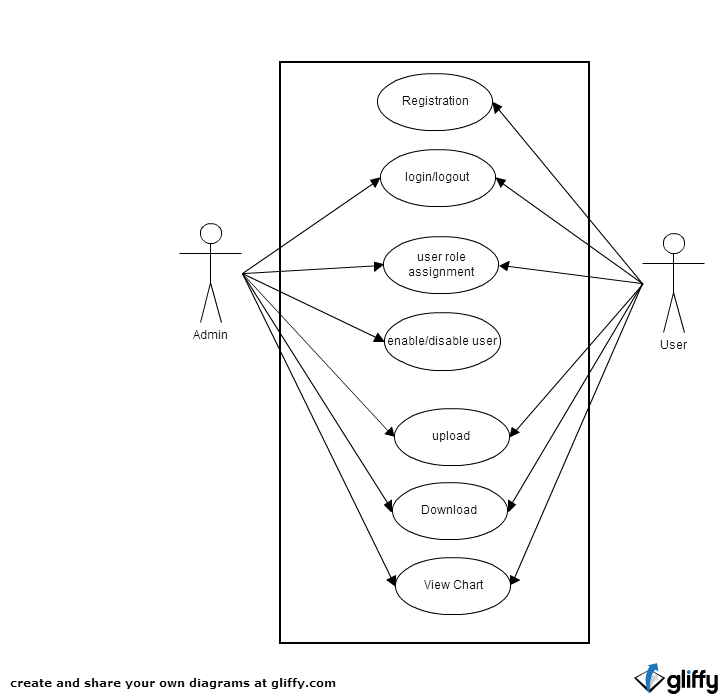

#User Management
Users can register themselves to the webpage and data is stored into database. Next time, users are indentified using browser cookies.

###DataBase Fields

####User table
-	Username 
-	Name-LastName
-	Password
-	Roles

####Custom Charts
-	Chartdata
-	Charttype

####Roles
-	Roles

####User Rights
-	Time
-	Product
-	Resolution

# Download

After Users decide to download a chart, they go to download page by clicking download icon. In download page, they can modify the data and create csv files. 

##- Questions
Why users are not allowed to download charts directly?

#Upload
Users can upload cvs formatted files to the webpage. This data is parsed and saved into database and displayed on a chart

##Security structure

