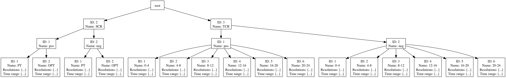

This document defines the basic terms of Enwida's business logic.

## Line
A _line_ describes a list of 2-dimensional data points.
A line is also the smallest unit of data which can be requested from the data manager.
As the name suggests, a line corresponds further to a visual line in a line chart.

But often we talk about lines not in the context of the actual line data, but we mean the set of parameters of the corresponding line _request_ which are the following (see class LineRequest in the transport layer):

- TSO
- Product
- Aspect
- Resolution
- Time range
- (Language/locale)

All of these parameters are defined in this document.

## TSO
The _TSO_ (Transport System Operator) describes the source of the supplied data. 
It is represented by an integer where the default value is 99 for the Grid Control Cooperation Germany.
Each TSO provides data for a set of _products_ and _aspects_.

## Product
Since the energy market is not just one common marketplace, we can distinguish different _products_.
A product usually consists of three components:

- Category (primary, secondary, tertiary)
- Direction (so-called positive and negative energy)
- Time slot (e.g. 0-4, 12-16, PT)

The internal representation of a product is a 3-digit (decimal) integer where each digit encodes one of the above components.
Examples: 

- 211 encodes (secondary, positive, PT)
- 311 encodes (tertiary, positive, 0-4)
- 323 encodes (tertiary, negative, 8-12)

As you can see, this encoding scheme is not intuitve and rather difficult to reason about.
Fortunately, these integers usually stay constant the whole way from the HTTP request to the database, meaning we do not have to reason about them.
There is one notable exception, though: the product may contain one or more (decimal) zeros.
These do not directly correspond to a component but are interpreted as a wildcard.  Examples:

- 201 encodes (secondary, positive and negative, PT)
- 300 encodes (tertiary, positive and negative, all time slots)
- 320 encodes (tertiary, negative, all time slots)

A wildcard for the first component would result in a less than 3-digit (decimal) integer.
However, there is no such case yet.

Currently, we handle these wildcards by querying the database for all products ranging from the original value to the original values with all zeros replaced by nines.
Of course this works only, if the last _n_ decimal digits are zeros. Examples: 

- 200 queries for 200-299
- 310 queries for 310-319
- 305 queries for 305-395 which is obviously not what we intended

By the time a case like the last example occurs, this scheme must be changed.

## Aspect
An _aspect_ describes what information about a certain product are of interest.
Some abstract examples are energy, price or volume.

Aspects are represented as instances of the enumeration type `Aspect`.
They also appear as the string or the ordinal value of such an instance. (TODO: harmonize these)

## Resolution
The _resolution_ describes the temporal granularity of data. Some examples are hourly, daily or yearly.

A resoultion is represented as an instance of the enum type `DataResolution`.

## Time range
A _time range_ describes all points in time between two timestamps.

It is represented either by the utility class CalendarRange or as two separate parameters timeFrom and timeTo.

## Chart navigation
The _chart navigation_ contains all possible user selections as well as all information needed to derive line requests from such a user selection.
It is passed to the frontend where it is used to display control elements the user can use to make his/her selection. 
Once a selection is made, it is used to pass all required information for one or more line requests to the server.

It is represented by the class `ChartNavigationData` in the backend or its JSON equivalent in the frontend.
There is one chart navigation for each chart ID.
They are stored in `$ENWIDA_HOME/conf/navigation` as Jackson-parsable JSON files where the file names correspond to the chart IDs.

Besides some visual and language information, a chart navigation consists of

- A list of product trees (one for each TSO, see below) describing all available TSOs and their products as well as their restrictions
- A list of time ranges the user may select (e.g. one month, one day etc.)
- A list of aspects
- Chart defaults (a default user selection)

### The product tree
As we saw in the [product](#Product) section, the integers representing a product contain a lot of implicit information.
The product tree is an attempt to make these explict by dividing the product in its components.
Each of the components is represented by one level in the n-ary tree.
The inner nodes hold a number and a string where the leaves additionally contain a list of resolutions and a time range.
Each node represents one value of a specific component, by holding its decimal digit and its name.
The leaves also contain restrictions in the allowed resolutions and the time range.

The order of the tree levels corresponds to the order of decimal digits in the product integer.
This way, we can obtain the product integer of a leaf by following the node path from the root and multiplying the current value by 10 and adding the id of the current node. 

Examples:

- {id: 3, name: "TCR"} is an inner node of the first level (root level is considered 0) corresponding for example to the first decimal digit in the product integer 311
- {id: 2, name "neg"} is an inner node of the second level corresponding to the second decimal digit of a product integer
- {id: 3, name "8-12", resolutions: [DAILY, WEEKLY], timeRange: {from: "2010-01-01", to: "2012-01-01}} is a leaf node corresponding to the third decimal digit of a product integer and containing restrictions for the product
- The three nodes above form the product integer 323

The following image shows a typical product tree:

