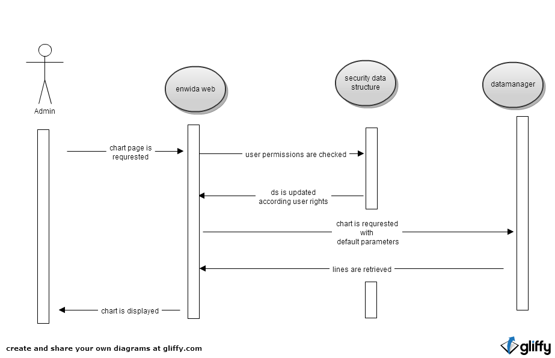
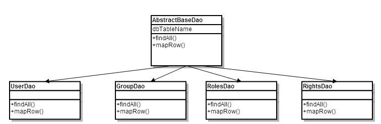
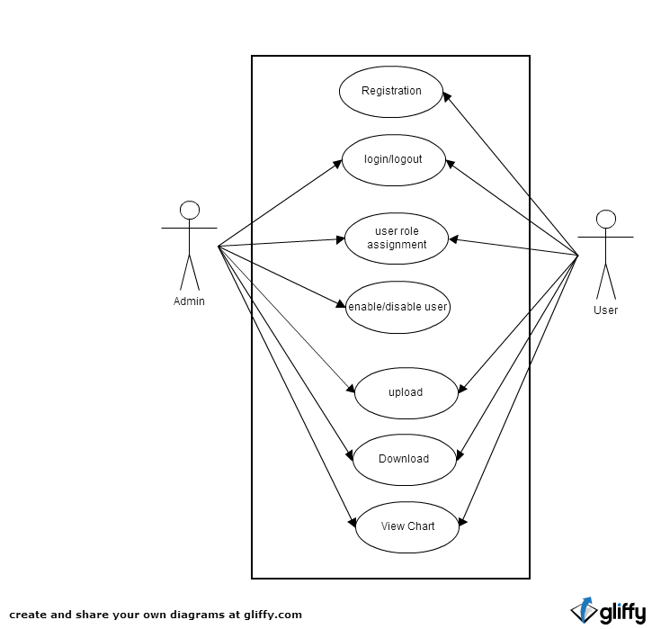

##INTRODUCTION

The purpose of this document to put together the detailed design of IDP work. A user should able to install the IDP project with the help of this document.

##SYSTEM OVERVIEW

The webpage is providing scientific data to the users. The data can be displayed in charts or tables and can be downloaded as files and it is usually timelines in 15 min up to 1 month resolution, the display time ranges from 1 day to several years. Besides that, there are also other x-y-charts, that don’t have a time scale. The raw data reaches over several years and has several GB. It is not trivial to change the resolution, that’s why the raw data is already precalculated in different resolutions. The data is stored in a postgreSQL database, as an interface to the webpage a java program can be used/adapted.

##INSTALLATION
Please follow these steps to install Enwida IDP application

- Set Enwida Environment Variable. Ex:

- Clone the code from the Repository. 

   ` $ git clone https://github.com/enwida/idpRepo.git`

- Install required jar files which is not in mvn repository.
•	json-io-2.0.jar

   ` $ mvn install:install-file -Dfile= <path-to-jar-file> -DgroupId=com.cedarsoftware -DartifactId=json-io -Dversion=2.0 -Dpackaging=jar`

- Execute Database Script

We use postgreSQL as a database and db.user.sql(should be found under database directory) script should be executed to create user related DB tables and default admin user. At the end, admin@enwida.de user with password “admin” will be created with admin rights.

- Compile the project

   ` $ mvn clean install`

##LOGIN MANAGEMENT

Spring security is used for login management. Page permission configuration will be configured by security-app-context.xml. Users will be retrieved from the database according the configuration sql commands.

Database Schema

##Security structure

   
##DAO structure

###ADMIN PAGES

**Page Name: User** 

  Details of user1
  

    First Name
  

  

    Last Name
  

  

    Joined Date
  

  

    Tel
  

  

    Logo
  

  

    Cookie
  

  

    Log Details
  

  

    Operations:Delete User,Edit Group,Reset password,Save Changes
  

Log information is displayed as folowing format

  User name
  

    TimeStamp,Visited Directory,IPAddress,IsloggedINBrowserType,Referer Link
  

**Page Name: User List** 

  Users
  

    Mail,Enabled,Name,LastName,LastLogin,Company,Tel,Operations(edit)
  

**Page Name: Group List** 

  Groups
  

    Group,Users,AutoPass,Operations(delete,add)
  

  Assign-Deassign Group
  

    Group, User,Operations(assign,deassign)
  

**Page Name: Role List** 

  Roles
  

    Roles,Description,Groups,Operations(details)
  

  Assign-Deassign Role
  

    Role, Group,Operations(assign,deassign)
  

**Page Name: Role List Details** 

  Roles Name
  

    Aspect,Product,T1,T2Res,tso,Operations(enable/Disable)
  

###User Pages

Users can register themselves to the webpage and data is stored into database. Next time, users are indentified using browser cookies.

**Page Name: Login** 
Users will be redirected to previous page after successful login.
This will be handled with the following logic.

1. Whenever login page is requested, Referer value will be kept in a special field called “url_prior_login”

1. After successful login custom implementation of “SavedRequestAwareAuthenticationSuccessHandler” will redirect user to the previous page.

**Page Name: User Details** 

  User:user1
  

    First Name
  

  

    Last Name
  

  

    Joined Date
  

  

    Tel
  

  

    Logo
  

  

    Operations:Delete Account,Reset password,Save Changes
  

**Page Name: Registration** 

- Mail information are also used as a user name and users are forced to use their company names. 
- Non-company email domains such as (gmail,yahoo,outlook) are defined in database as blacklist and won’t be allowed to register. Company name are extracted from the mail domain.
- Users can able to write company logo links which are used in the future for their pages.
- Logo is tried to retrieve from company web address automatically.
- Allowed email address are allowed and groups are be assigned according to CompanyName autoPass property

**Logo Download** 
During the registration process,after user mail input, domain name is extracted from the mail and using HTMLUnit Browser all images from that website is retrived.Then according the image size(images smaller then 100X100), they are proposed to user for selection

###USER TRACKING AND LOGGING
Following logging files are generated

-	System based logging
All system errors, debug infos are presented in “logging.log”

-	Logged in user
If user is logged, requested pages, browser type and ip addresses are presented in log files named as “username.log”

-	Not Logged in user(anonymous) with cookie 
If user is not logged in but has a cookie in the browser, requested pages, last user name are used

-	Not Logged in user(anonymous) without cookie 

If user is not logged in and doesn’t have a cookie, unique clientID are assigned and until user logins, client id is used for logging.

###DOWNLOAD

As sometimes it is possible to request large amount of data, web page won’t be enough to see the data. So users are allowed to download data using following settings. A preview are provided to help user

•	Multiple Aspects
•	Range (start date and end data)
•	Product
•	Resolution

Same Chart Request workflow will be used in Download page
 

##Upload
Users can upload cvs formatted files to the webpage. This data is parsed and saved into database and displayed on a chart

###Testing
####Testing Web page availability and functionality
HtmlUnit is used for testing the admin pages.HTMLUnit behaves like a browser and during the tests every browser actions can be simulated.

####Testing Database Access Objects functionality

All dao methods are testing in userManagement.java file.This Junit tests calls all the functions to catch any failures.
