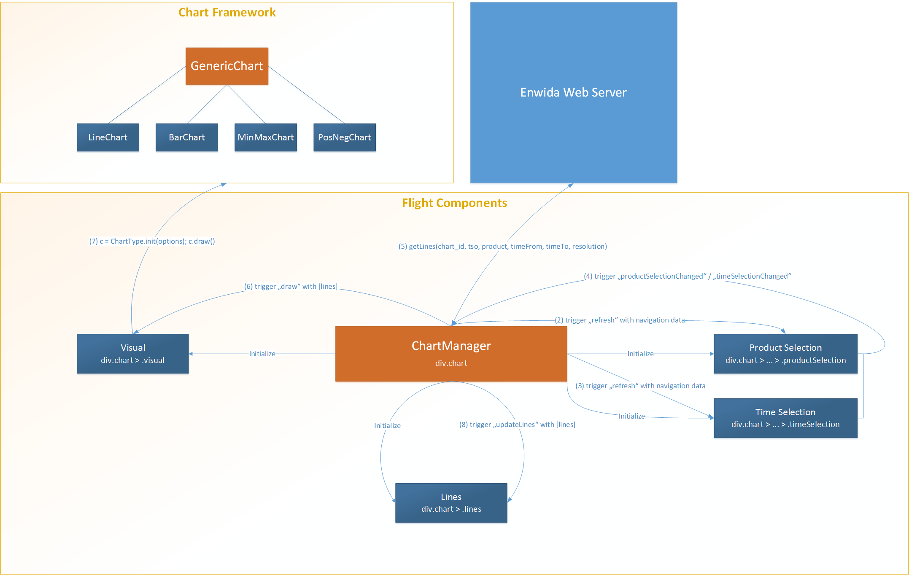

## Location
The charts frontend code is located within the web resources of the Spring web project:

``$ENWIDA_WEB_ROOT/src/main/webapp/resources``

The chart-specific CSS files can be found in the subdirectory

``css/chart``

whereas the CoffeeScript/JavaScript sources live in the

``js/chart``

subdirectory.

## Tools / Libraries
As our implementation relies on 3rd party libraries and frameworks, we try separate these so-called
"assets" from the actual charts frontend.
So any HTML document which contains charts has to include the following files:

- resources/css/chart/assets.css
- resources/css/chart/chart.css
- resources/js/chart/assets.js
- resources/js/chart/chart.js

[TODO: Only one css/js file in production (complicates development, though)]

### CSS
In order to minify the CSS assets (bootstrap, datepicker, etc.) we use the tool `cleancss`.
When adding or removing CSS assets, please edit the `Makefile` in the `css/chart` directory to
reflect the changes. A new `assets.css` file can be generated by executing the `make` command in
this directory. It will minify the source CSS assets (usually located in the `assets` subdirectory)
given in the `Makefile` to a file called `assets.css`.

### JavaScript
We use `uglifyjs` to minify JavaScript sources/assets like jquery or bootstrap. The
assets compilation is handled by the `Makefile` located in the `js/chart` subdirectory. In order to
only compile the JavaScript assets to a single `assets.js` file please invoke the command
`make compile_assets`.

We don't write plain JavaScript for our charts frontend logic but use the cleaner and more concise
[CoffeeScript](http://coffeescript.org) which "compiles" down to JavaScript.
In order to provide a modular design for the charts implementation, we additionally use 
[require.js](http://requirejs.org) for this matter.
The compilation of the JavaScript sources thus involves the following steps:

- Minify the JavaScript assets
- Compile all .coffee files to their respective .js equivalent
- Minify the compiled require.js modules into one file

All of them are accomplished at once by invoking the `make` command.

During the development process it is often convenient to skip the last step because debugging
minified JavaScript code isn't fun at all.
To achieve this, you can invoke `make dev` instead of the parameter-less variant.
Note that this does _not_ mean you will have to include every single .js file in your HTML
document as the loading of the modules is managed by the `require.js` library.
You can even automatically compile every .coffee file into a .js file as soon as it changes by
executing the command `coffee -wc .` in the `js/chart` directory.

### Requirements Installation
While the previous section was about why we need all these 3rd party tools, this section shows how
these requirements can be installed.

- Install [node.js](http://nodejs.org) (including the `npm` command-line tool)
- Install the `make` command (should be preinstalled on all *nix systems, use
[cygwin](http://www.cygwin.com) or
[GnuWin32](http://gnuwin32.sourceforge.net/packages/make.htm) for Windows)
- Install the remaining requirements: `npm install -g coffee-script clean-css uglify-js requirejs`

[TODO: Test if these steps work for Windows ;)]

### Quick CoffeeScript / RequireJS / Flight Walkthrough
This walkthrough will only contain very basic explanation to get you started. Please refer to the
corresponding websites ([coffeescript.org](http://coffeescript.org),
[requirejs.org](http://requirejs.org), [twitter.github.io/flight](http://twitter.github.io/flight)) for more detailed introductions, tutorials and documentation.

#### CoffeeScript
The CoffeeScript syntax is very similar to the JavaScript syntax but I will try to point our the
most important differences here.

##### Semicolons
Semicolons are not necessary in CoffeeScript. Don't use them.

##### Assignments
The JavaScript expression `name = "John"` assigns the string "John" to the _global_ variable `name`.
In general this is considered bad style because it is very easy to pollute the global namespace
this way. Instead we have to write `var name = "John"` in order to create a _local_ variable.
CoffeeScript makes it really difficult to accidentally assign to a global variable. So every
assignment of the form `name = "John"` is translated to use a local "name" variable. The `var`
keyword is forbidden and its usage will throw a compiler error. If you _really_ want to assign
to a global variable, you have to assign to the `window` object explicitly: `window.name = "John"`

tl;dr: `name = "John"` is an assignment in CoffeeScript which uses local variables.

##### Functions
The CoffeeScript expression

```coffeescript
(name, age) -> console.log name + " is " age + " years old"
```

translates to the following JavaScript:

```js
function(name, age) { console.log(name + " is " + age + " years old"); }
```

As you can see, the function syntax contains less boilerplate and has the form `(arguments) -> body`,
whereas function application does not require parenthesis if there is more than one argument
(you can use them, though).
The following example shows how to write nested functions with more than one line in the body and
how function application binds tightly. It also shows the comment syntax, indentation rules, implicit
returns, string interpolation and a bit of functional programming.

```coffeescript
# Simple function definition
add = (a, b) -> a + b

# Function with a multi-line body
curriedAdd = (a) ->
  # Indention matters!
  console.log parseInt a

  # Return a function
  (b) ->
    # Indention matters!
    # String interpolation with #{expr}
    console.log "b is: #{parseInt b}"
    # The last statement of a function body
    # is it's return value. But you can use
    # an explicit return, too.
    return a + b

add 1, 2                 # yields 3
add(1,2)                 # yields 3
add 1, parseInt "2"      # yields 3
add 1, parseInt("2")     # yields 3
add parseInt("1"), 2     # yields 3
add (parseInt "1"), 2    # yields 3
add parseInt "1", 2      # not what you want! (add(parseInt("1", 2))

curriedAdd(1)(2)         # yields 3
curriedAdd(1) 2          # yields 3
curriedAdd 1, 2          # not what you want! (curriedAdd(1,2))

addThree = curriedAdd 3  # returns a function
addThree 5               # yields 8
addThree 8               # yields 11

console.log [1,2,3,4].map (i) -> i + 1 # prints [2,3,4,5]
console.log [1,2,3,4].map addThree     # prints [4,5,6,7]

hello = -> console.log "hello"
hello()       # prints hello
hello         # not what you want (returns the function)
hello "world" # prints hello (function ignores parameters)
```

The functions are translated to (an equivilant of) the following:

```js
function add(a, b) { return a + b; }

function curriedAdd(a) {
  console.log(parseInt(a));
  return function(b) {
    console.log("b is: " + parseInt(b));
    return a + b;
  };
}
```

Some of the function applications in JavaScript:

```js
console.log(add(1,2));
console.log(curriedAdd(1)(2));
var addThree = curriedAdd(3);
console.log(addThree(4));
console.log([1,2,3].map(function(i) { return i + 1 }));
console.log([1,2,3].map(addThree));
```

#### RequireJS

RequireJS provides means to define and load JavaScript modules which sadly is not a build-in feature
of the language.
Writing a module is as simple as (using CoffeeScript syntax):

```coffeescript
define ->

  # The importer of the module will see
  # whatever you return here. In this
  # case an object containing two functions
  functionA: -> console.log "hello"
  functionB: -> console.log "world"
```

Using the path of the module file, you can now import it:

```coffeescript
require ["dummy"], (Dummy) ->
  # Say hello and world
  Dummy.functionA()
  Dummy.functionB()
```

To define the dependencies of a module use the following syntax:

```coffeescript
define ["dependencyA", "dependencyB"], (DepA, DepB) ->
  # Can access DepA and DepB here
```

Normally, RequireJS loads the modules from the server when they are needed the first time. However,
it is also possible to minify all modules into a single .js file using the `r.js` utility. The
`Makefile` in the `js/chart` directory takes care of this.

#### Twitter Flight
[Twitter's Flight](http://twitter.github.io/flight) is an event-driven frontend framework
which lets you define so-called components whose job it is to "take care" of a specific DOM element.
The only way these components can communicate is by triggering events.

Using RequireJS and Flight, a component is defined like this:

```coffeescript
define ->

  flight.component ->

    @hello = -> console.log "hello"

    @after "initialize", ->
      console.log "I'm assigned to the following element:"
      console.log @node  # DOM element
      console.log @$node # jQuery-wrapped element

      @on "sayHello", ->
        @hello()
        @$node.text "hello"
      @on "sayBye", ->
        @$node.fadeOut()
        @trigger "refresh"
```

This component listens to two events: "sayHello" and "sayBye". It also trigger a "refresh" event
after it received the latter. An event travel up the DOM elements until a component handles it.
Futhermore, you can send an event to a specific element which also carries data by using something
like: `@trigger "#content", "refresh", greeting: "hello"`.

Note: The symbol `@` is an abbreviation for the keyword `this` in CoffeeScript. Moreover you will
see something like `(param) => ...` in component code. This works just like an ordinary function
definition but keeps the `this` reference stable in the body. This is often used to call
component functions inside a callback.

## Usage
In order to use the charts frontend, all you have to do is including the required CSS and JavaScript
files and having one div element for each chart in the HTML document.
The div elements must be of class "chart" and have an attribute called `data-chart-id` set to
the desired chart ID. Other (optional) attributes are:

- `data-chart-type`: "linear", "bar", "minmax", "posneg", or "carpet" (defaults to "linear")
- `data-width`: width of the SVG in pixels (defaults to 800)

Example:

```html
<!doctype html>
<html>
  <head>
    <title>Charts</title>
    <link rel="stylesheet" href="/enwida/resources/css/chart/assets.css" >
    <link rel="stylesheet" href="/enwida/resources/css/chart/chart.css" >
    <script src="/enwida/resources/js/chart/assets.js"></script>
    <script src="/enwida/resources/js/chart/charts.js"></script>
  </head>
  <body>
    <div class="chart" data-chart-id="0"></div>
    <div class="chart" data-chart-id="0" data-chart-type="bar"></div>
    <div class="chart"
         data-chart-id="1"
         data-chart-type="carpet"
         data-width="1200">
    </div>
  </body>
</html>
```
    
## The Charts Frontend Implementation

### Architecture
An overview of the architecture and the communication between the frontend components and the 
web server is visualized in the following diagram ([high resolution version](frontend_overview.pdf)).

<a href="img/frontend_overview.png"></a>

#### Directory Structure
Important files/directories in `js/chart`:

- `assets/` contains the JavaScript assets
- `assets.js` contains all assets in minified form
- `charts.coffee` is the main script
- `lib/` contains all RequireJS modules
- `lib/components` contains all Flight components
- `lib/drawable` contains the modules which actually draw the charts
- `lib/util` contains some utility modules

### Layout
The basic layout of the chart element is shown in the following structure.

<div style="border: 1px solid black; padding: 10px;">
  .chart
  <div style="border: 1px solid black; padding: 10px; margin: 10px;">
    .visual
  </div>
  <div style="border: 1px solid black; padding: 10px; margin: 10px;">
    .lines
  </div>
  <div style="border: 1px solid black; padding: 10px; margin: 10px;">
    .navigation
  </div>
</div>

The outer chart div element of class "chart" has another three div elements as its children.
The child of class "visual" contains the actual chart (the SVG image). All elements for
enabling/disabling single lines are included in the "lines" div element. The "navigation" div
element contains all elements representing product and time range selection.

Each of these elements has a Flight module attached to it:

- .chart: `ChartManager`
- .visual: `Visual`
- .lines: `Lines`
- .navigation: `Navigation`

When loaded, the main script will find all divs of class "chart" and attach a new instance
of the `ChartManager` component to each of them. The `ChartManager` will then create the
"visual", "lines", and "navigation" div elements and attach the corresponding Flight components
to them.

### Imaging
The actual chart images are implemented using the [d3.js](http://d3js.org) library which is used
to create inline SVG images. Sincle SVG uses an XML format, the images can be created by adding
new elements to the DOM (just like any other HTML elements as div, h1, etc.).

#### Chart Types

##### Line Chart
The line chart can show several lines of data at once using linear interpolation between the
data points.

##### Bar Chart
The bar chart can show several lines of data at once whereby the different lines are represented
by differently colored bars located next to each other for each data point.

##### Min-Max Chart
This chart type works for exactly three lines of data. The first and the last line represent the
minimun and the maximum values respectively whereas the second line contains the average values.
The second line is drawn as in an ordinary line chart.
Additionally, a bar ranging from the minimun to the maximum value is drawn for each data point.

##### Positive-Negative Chart
This chart type takes exactly two lines of data whereby the first line contains positive values 
while the last one contains negative values.
The lines are drawn as bars one below the other in different colors ranging from 0 to the positive
value and from 0 to the negative value, respectively.

##### Carpet Chart
This chart works with exactly one line of three-dimensional data (x, y, v). For every (x, y)-pair
one bar is drawn at the corresponding coordinate. The color of the bars is governed by the v value.
Futhermore, a scale is drawn on the right side which maps colors to v values.

[TODO: pictures]

#### Implementation
Each of these charts are implemented as a RequireJS module in the `drawable` subdirectory.
There is also a module called `GenericChart` which encapsulates common functionality like scale
setup and drawing of the SVG skeletion including the axes.

#### Interface
Every chart module exports an `init` method which takes an options object as its only argument and
returns the corresponding chart object which exports a `draw` method.
The options object has the following form:

```
{ 
  parent: element       # The element the SVG is drawn into
  lines: [line]         # The lines to draw
  disabledLines: [int]  # Disabled lines as indices (optional)
  xLabel: string        # X axis label (optional)
  yLabel: string        # Y axis label (optional)
  width: int            # SVG width (optional)
  height: int           # SVG height (optional)
  scale: {              # Scale setup (optional)
           x: scaleOptions
           y: scaleOptions
         }              
}
```

A line object has the following form:

```
{
  title: string
  dataPoints: [{ x: double, y: double }]
  # dataPoints for carpet chart: [{ x: double, y: double, v: double }]
}
```

The scale options have the following format:

```
{
  type: scaleType              # Supported: "linear", "ordinal", "date"
  dateFormats: [               # Adaptive date formats when using date scale
                 [compareFormat, showFormat]
               ]
  domain: {                    # Domain setup
            type: [domainType] # Supported: "extent", "map", "stretch", "fixed"
            high: double       # Upper bound for fixed domain
            low: double        # Lower bound for fixed domain       
          }
}
```

##### Scale Types
A _linear_ scale maps every value between its lower and upper bound to the corresponding position
on the axis. So there are infinitely many values such a scale can take as an argument (ignoring
the fact that there is only a finite set of floating point numbers between two values).
The domain of a linear scale is an array with two elements: `[lowerBound, upperBound]`.

By contrast, _ordinal_ scales map a finite set of values to axis positions without any interpolation
taking place. This scale type is usually used in bar charts.
The domain of such a scale is an array of possible values: `[val1, val2, ..., valn]`

_Date_ scales work just like linear scales, except that its values are interpreted as JavaScript
timestamps (milliseconds since epoch). These will be translated their corresponding date
representation using an adaptive strategy. The date formats used for this strategy can be
configured in the chart options object (see code block above). The strategy does the following:

- The first timestamp is displayed using the `showFormat` of the first element in the array.
- For every following timestamp:
    - For every element in the date formats array:
        - The timestamp is converted to a string using the `compareFormat`
        - This string is compared to the `compareFormat` of the previous timestamp
        - If they differ the current timestamp's representation is retrieved using the
          current `showFormat`


### Tooltips
Tooltips are implemented using the JavaScript library
[tipsy](http://onehackoranother.com/projects/jquery/tipsy).

Every data point in a line chart as well as every bar show a tooltip on mouseover displaying the
name of the line and the x and the y value of the corresponding data point.
There are also tooltips on the tick labels of date scales which show the corresponding timestamp
in a full date format.

This is achieved by setting the `original-title` attribute of the elements in question and calling
the `tipsy` function on their corresponding jQuery wrapper object.

### Navigation
The navigation layer of the charts frontend can be divided into three components:

- Line selection
- Product selection
- Time range selection

The former is handled by the `Line` Flight component whereas the other ones are both processed
by the `Navigation` Flight component (there is room for improvement).

#### Line Selection
The line selection component is pretty simple.
It listens for `updateLines` events and shows the passed lines with their color and title to the
user. If the user clicks on one of these representations the component will trigger a
`toggleLine` event to the `ChartManager` which is then responsible for hiding the disabled
lines and sending a request to the web server updating the user's preferences for this chart type.

Furthermore, the component listens for `disabledLines` events in order to keep its array of
disabled lines up-to-date. This is especially useful when the `ChartManager` sends the set of
disabled lines from the user's navigation defaults. This way, the component knows about the disabled
line before the line information actually arrive through the `updateLines` event.

#### Product Selection
When the `Navigation` component is initialized, it creates the required combo boxes (HTML `select`
elements) for TSO and product number parts.
Afterwards, the navigation data for the corresponding chart id are requested from the web server.
This data is then used to fill the combo boxes with their corresponding options. The product trees
play an important role in this process. As a next step, the default values are applied to the
elements a `getLines` event is triggered to the `ChartManager`. This way, the user sees the
chart representing his/her default selection.

When the users selects a new product configuration another `getLines` event is fired.
Moreover, the product selection elements adapt their values according to the product trees.

#### Time Range Selection
The user is allowed to select one of four predefined time ranges:

- A day
- A week
- A month
- A year

He/she also has to select the beginning of the specific time range. For this matter a modified
version of the [improved bootstrap datepicker](http://eternicode.github.io/bootstrap-datepicker)
has been used.
Depending on the selected time range it allows you to select a single day, a single week, a single
month, or a single year. As soon as the time range or the beginning date are changed, a
`getLines` event is fired.

A separate timestamp is managed for each time range which is synchronized when a beginning date
of another time range is changed.

Example: the user selects a daily time range and 2010-12-15 as the beginning timestamp. Then he/she
switches to a monthly time range. Now data of the whole december of 2010 is shown. Afterwards the
user selects March of 2011 whereupon the corresponding data is displayed. When he/she now switches
back to a daily time range, date for 2011-03-15 is shown.

Technically, this is achieved by maintaining four different datepickers of which only one is
visible at all times. Each of these corresponds a specific time range and synchronize the way
described above.

##### Resolution Calculation
As the user is not allowed to select the data resolution himself/herself, it is calculated by the
`Resolution` utility module. The calculation takes the chart type, the selected time range, the
SVG width, the number of lines to display, as well as the set of allowed resolution into account.
Each chart type has an optimal and a minimal width per data point assigned to it (currently
ill-named "optimalDensity" and "maximumDensity"). The algorithm tries to match the optimal width
as good as possible without being below the minimum width.

